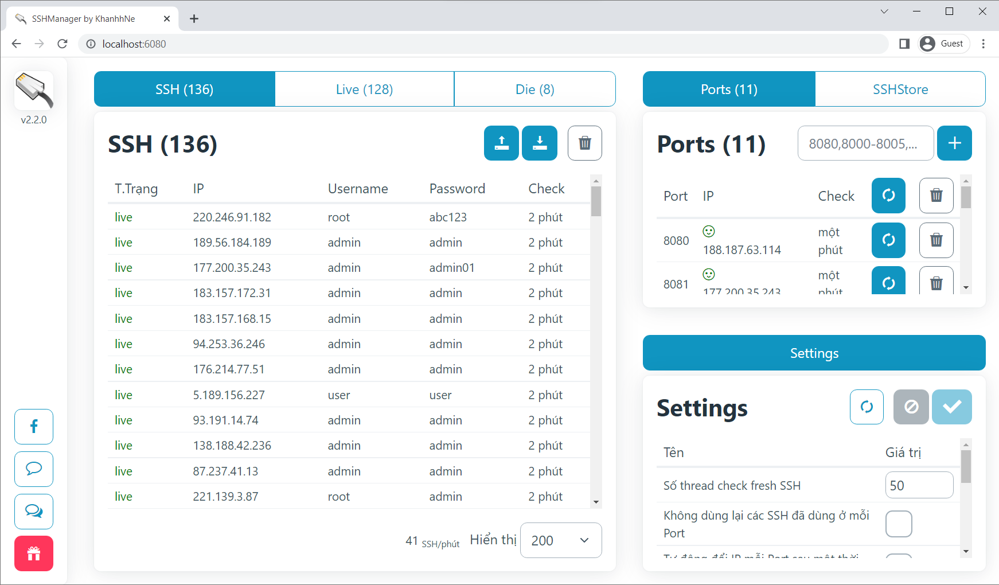

# SSHManager

Tool check fresh và tạo proxy Socks5 tự động từ SSH.

Đơn giản hoá các thao tác liên quan đến SSH và tự động tạo proxy Socks5 từ SSH
dễ dàng nhất.

  <!--suppress CheckImageSize -->
  

Tính năng nổi bật
----

- **Check SSH đa luồng**: `SSHManager` đảm bảo tốc độ check fresh SSH và kết nối
  tối ưu nhất (nhờ thư viện `AsyncSSH`)
- **Setup proxy Socks5 tự động**: Tự động tạo proxy Socks5 cho mọi port local mà
  bạn muốn, đảm bảo thời gian "disconnect" tối thiểu, tự động kết nối lại nếu bị
  mất kết nối
- **API tương tác đơn giản**: `SSHManager` có đầy đủ API để tương tác với backend
  và thực hiện gần như mọi thao tác bạn có thể làm bằng giao diện. Toàn bộ API đều
  được thiết kế kĩ lưỡng để ai cũng có thể tích hợp `SSHManager` vào công việc của
  mình
- **Mã nguồn mở**: Sứ mệnh của `SSHManager` là trở thành tool quản lý SSH tốt nhất,
  minh bạch và an toàn nhất, vì vậy mã nguồn `SSHManager` sẽ luôn được public trên
  GitHub để tất cả mọi người đều có thể sử dụng cho mục đích của mình một cách miễn
  phí.

Ảnh chụp màn hình
----

  <!--suppress CheckImageSize -->
  

Hướng dẫn sử dụng
----
Mua phiên bản exe portable tại đây: <a href="https://taphoammo.net/gian-hang/sshmanager-v2-2-ban-moi-nhat">Link</a>

Tải phiên bản mới nhất từ link trên, giải nén và chạy file `sshmanager-v2.exe`.
Cửa sổ trình duyệt mặc định sẽ mở ra với URL của tool. URL đó cũng có thể
truy cập từ các thiết bị khác trong cùng mạng LAN.

Sau khi chạy `SSHManager`, bạn có thể truy cập `http://localhost:6080/docs` để
tham khảo tài liệu API của `SSHManager`.

Liên hệ hỗ trợ
----
Liên lạc mình thông qua thông tin liên lạc bên dưới (ưu tiên Facebook) hoặc
thông tin liên lạc trong giao diện `SSHManager` nhé.

Theo dõi mình
----
Facebook: https://www.facebook.com/khanh.luong.6  
LinkedIn: https://www.linkedin.com/in/khanh-luong-quang  
Linktree: https://linktr.ee/khanhhne
